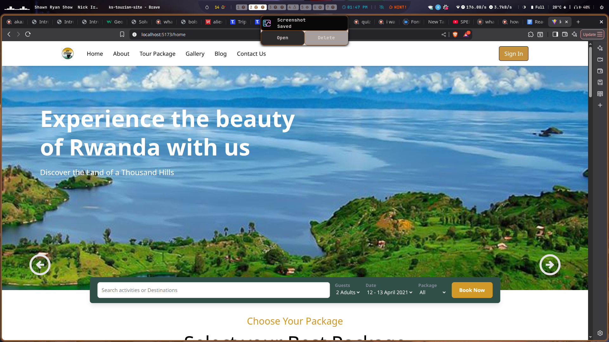

# Ks Tourist Site

# About

This site is a 5 page app that makes use of router to switch the various pages home, about, tour package, gallery and contact us

## Built With

- React
- Tailwind

## Clone project

- To get a local copy up and running follow these simple example steps.
- Clone this repository with `git@github.com:JaffDavy/ks-tourist-site.git` using your terminal or command line.

## Command line steps

- $ git clone `$ git@github.com:JaffDavy/ks-tourist-site.git`

## Start App

- run `npm install`
- run `npm start` in your command line

## Live Site

[Link](ks-tourist-site-git-development-jaffdavys-projects.vercel.app)

## Author

👤 **Jaff Davy-Arnold**

- GitHub: [@JaffDavy](https://github.com/JaffDavy/)
- LinkedIn: [Jaff Davy-Arnold](https://www.linkedin.com/in/jaff-davy-arnold-5ba749297/)
